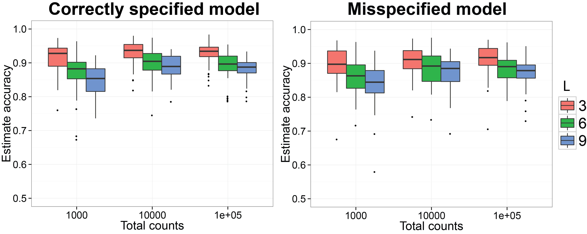
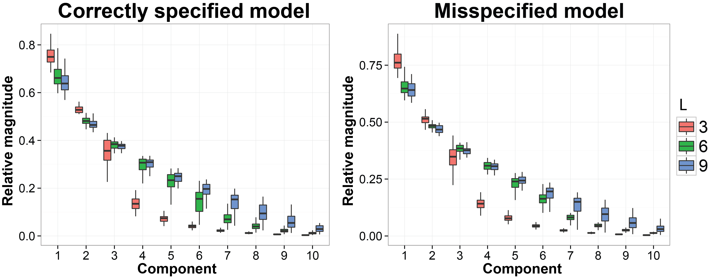
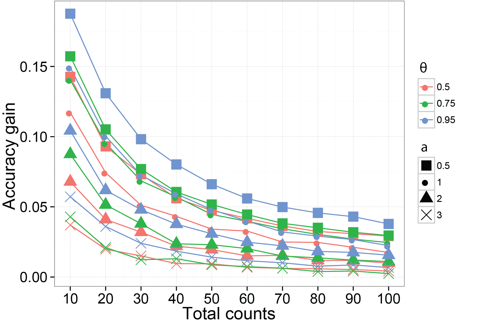
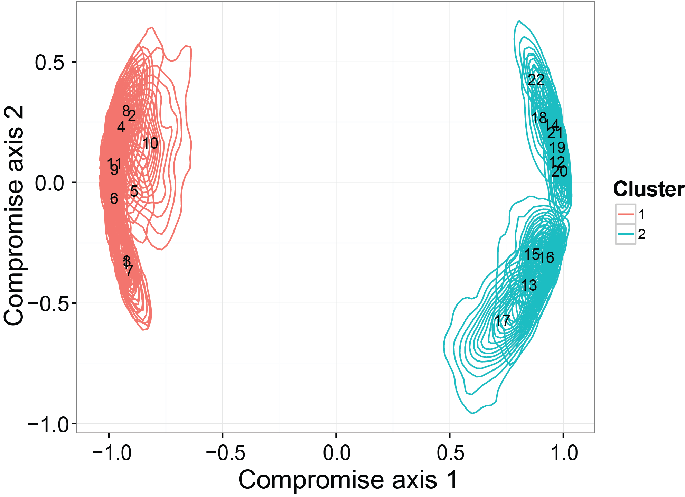
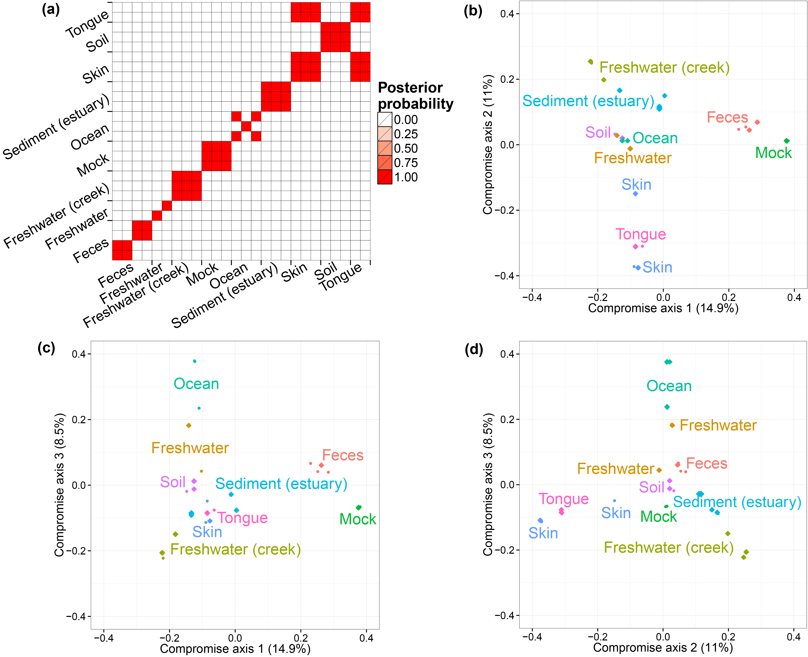
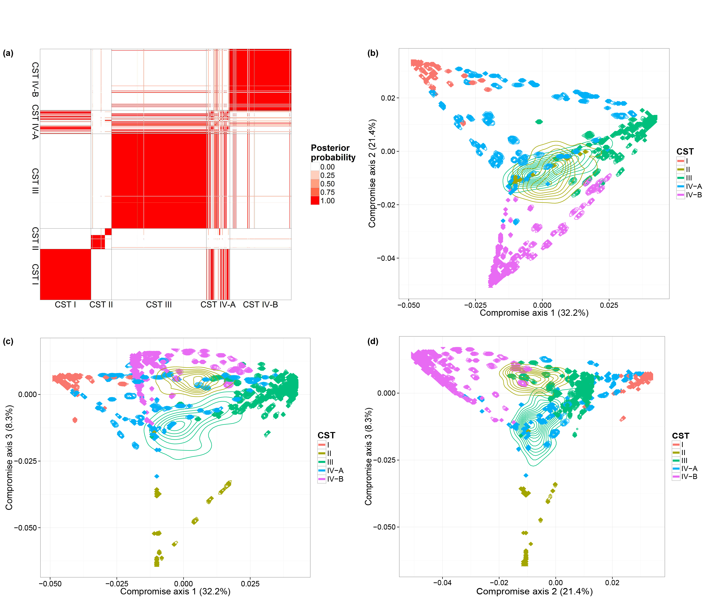

## Introduction

Human microbiome studies use sequencing technologies to measure the abundance of bacterial species or Operational Taxonomic Units (OTUs) in samples of biological material. Typically the data are organized in contingency tables with OTU counts across heterogeneous biological samples. In the microbial ecology community, ordination methods are frequently used to investigate latent factors or clusters that capture and describe variations of OTU counts across biologi- cal samples. It remains important to evaluate how uncertainty in estimates of each biological sample’s microbial distribution propagates to ordination analyses, including visualization of clusters and projections of biological samples on low dimensional spaces.

We propose a Bayesian analysis for dependent distributions to endow frequently used ordinations with estimates of uncertainty. A Bayesian nonparametric prior for dependent normalized random measures is constructed, which is marginally equivalent to the normalized generalized Gamma process, a well-known prior for nonparametric analyses. In our prior the dependence and similarity between microbial distributions is represented by latent factors that concentrate in a low dimensional space. We use a shrinkage prior to tune the dimensionality of the latent factors. The resulting posterior samples of model parameters can be used to evaluate uncertainty in analyses routinely applied in microbiome studies. Specifically, by combining them with multivariate data analysis techniques we can visualize credible regions in ecological ordination plots.

## How To Run

### Loading
We first need to load the package:
```{r load, eval=FALSE, warning=FALSE, results="hide"}
library(DirFactor)
```

### Package Features
The DirFactor package contains six functions:

* `DirFactor`, the main function for running Gibbs sampler on an OTU table.
* `ConvDiagnosis`, the diagnosis function to check if the posterior simulation mixed.
* `PlotStatis`, the plotting function to visualize nonparametric ordination results as well as its uncertainty given by the DirFactor model.
* `SimDirFactorBlock`, `SimDirFactorSym`,`SimDirFactorContour`, three related functions used to generate synthetic datasets considered in the simulation studies in [@Ren].

### Data and Prior Input 
For a full and complete description of the possible parameters for
`DirFactor`, their default values, and the output, see

```{r run-DirFactor-help, eval=FALSE, warning=FALSE, message=FALSE, results="hide"} 
?DirFactor 
```

#### Required Input
There are two required input for running `DirFactor`. A `data` matrix stores the OTU table of species abundance in each biological sample, where biological samples are be in columns and species in rows. A list `hyper` contains the values of the hyper-parameters of priors. By default, the starting values of the model parameters will be generated from the priors. Below is a minimal example for `DirFactor`. We use `SimDirFactorBlock` to simulate a synthetic dataset with 22 biological samples and 68 species with total counts per sample being $10^6$. The true Gram matrix between samples is a block-diagonal matrix with two blocks, which is induced by three latent factors. When running the MCMC, we specify the number of factors to be 10. `DirFactor` by default save the MCMC results in an temporary path and it will return the path once finished.

```{r default-run, eval=FALSE, cache=TRUE, warning=FALSE, message=FALSE, results="hide"}
hyper = list( nv = 3, a.er = 1, b.er = 0.3, a1 = 3, a2 = 4, m = 10, alpha = 10, beta = 0 )
sim.data = SimDirFactorBlock( 1e6, n = 22, p = 68, m = 3, hyper )
mcmc.out = DirFactor( sim.data$data[[1]], hyper )
```


## Simulation studies for DirFactor

We use the code for the simulation studies in [@Ren] to illustrate how to use DirFactor in general.

### Estimate the normalized Gram matrix between biological samples using DirFactor

Starting at this subsection, we will reproduce the simulation results in [@Ren]. We first want to check if the procedure can recover the normalized Gram matrix between biological samples accurately. We have already finished the MCMC simulation for 50 replicates on simulated datasets generated by `SimDirFactorBlock` when the model is correctly specified (`a`=2) and misspecified (`a`=1). We also consider the case when the dimensions of true latent factors are 3, 6 and 9 as well as when the total counts per biological sample is $10^3$, $10^4$ and $10^5$. We will load the results and plot the figures.

```{r sim-gram, eval=FALSE, cache=TRUE, warning=FALSE, message=FALSE, results="hide"}
get_corr = function( all.res ){
  lapply( all.res, function(y){ lapply( y, function(x){
  post.corr = lapply( x, function(mt) cov2cor( t(mt$Y)%*%mt$Y + diag( rep( mt$er, ncol( mt$Y ) ) ) ) )
  post.corr.mt = array( unlist( post.corr ), dim = c( dim( post.corr[[1]] ), length( post.corr ) ) )
  apply( post.corr.mt, c(1,2), mean )} ) } )
}

compare_correlation = function( filename ){
  all.res = readRDS( filename )
  cat( "Done readin\n" )
  corr.est = get_corr( lapply( all.res, function(x) x$res ) )
  cat( "Done corr est\n" )
  corr.tru = lapply( lapply( all.res, function(x) x$truth ), 
                     function(x) cov2cor( t(x$Y.tru)%*%x$Y.tru + diag( rep( x$er, ncol(x$Y.tru) ) ) ) )
  
  sapply( 1:length(corr.est), function(x){
    sapply( corr.est[[x]], function( mt ) rv.coef( mt, corr.tru[[x]] ) )
  })
}

# load the MCMC results
factor.3 = readRDS("factor_3.rds")
factor.6 = readRDS("factor_6.rds")
factor.9 = readRDS("factor_9.rds")
factor.3.mis = readRDS("factor_3_mis.rds")
factor.6.mis = readRDS("factor_6_mis.rds")
factor.9.mis = readRDS("factor_9_mis.rds")

#compute the accuracy (RV coefficients) of the estimated Gram matrices
corr.mt.est.3 = compare_correlation( "factor_3" )
corr.mt.est.6 = compare_correlation( "factor_6" )
corr.mt.est.9 = compare_correlation( "factor_9" )
corr.mt.est.3.mis = compare_correlation( "factor_3_mis" )
corr.mt.est.6.mis = compare_correlation( "factor_6_mis" )
corr.mt.est.9.mis = compare_correlation( "factor_9_mis" )

#boxplots to summarize all the RV coeffients
plot.corr.est = data.frame( rv = ( c( t(corr.mt.est.3), t(corr.mt.est.6), t(corr.mt.est.9) ) ),
                            total = as.factor( rep( rep( c(1000,10000,100000), 
                                                         each = ncol( corr.mt.est.3 ) ), 3 ) ),
                            tru.factor = as.factor( rep( c(3,6,9), each = 3*ncol( corr.mt.est.3 ) ) ),
                            group = as.factor( rep( 1:9, each = ncol( corr.mt.est.3 ) ) ) )

plot.corr.est.mis = data.frame( rv = ( c( t(corr.mt.est.3.mis), t(corr.mt.est.6.mis), 
                                          t(corr.mt.est.9.mis) ) ),
                                total = as.factor( rep( rep( c(1000,10000,100000), 
                                                             each = ncol( corr.mt.est.3 ) ), 3 ) ),
                                tru.factor = as.factor( rep( c(3,6,9), 
                                                             each = 3*ncol( corr.mt.est.3 ) ) ),
                                group = as.factor( rep( 1:9, each = ncol( corr.mt.est.3 ) ) ) )

# plot the boxplots
ggplot( data = plot.corr.est, aes( x = total, y = rv, group = group, 
                                   dodge = tru.factor, fill = tru.factor ), guide = F ) + 
  geom_boxplot() + xlab("Total counts") + ylab("Estimate accuracy") + 
  scale_y_continuous(limits=c(0.5, 1)) + theme_bw() +
  theme( axis.text = element_text( size = 15 ), axis.title = element_text( size = 18 ),
         legend.title = element_text( size = 15 ), legend.text = element_text( size = 15 ),
         plot.title = element_text( size = 18, face = "bold") ) +
  labs( fill = "No. factors") + ggtitle( "Correctly specified model" )

ggplot( data = plot.corr.est.mis, aes( x = total, y = rv, group = group, 
                                       dodge = tru.factor, fill = tru.factor ) ) + 
  geom_boxplot() + xlab("Total counts") + ylab("Estimate accuracy") + 
  scale_y_continuous(limits=c(0.5, 1)) + theme_bw() +
  theme( axis.text = element_text( size = 15 ), axis.title = element_text( size = 18 ),
         legend.title = element_text( size = 15 ), legend.text = element_text( size = 15 ),
         plot.title = element_text( size = 18, face = "bold")) +
  labs( fill = "No. factors") + ggtitle( "Misspecified model" )
```


### Shrink the dimension of the latent factros towards the correct dimension
We still use the previous MCMC results. This subsection we want to evaluate whether the estimated latent factors are concentrated on a linear space with the similar dimension as the dimesion of the true latent factors. The code we use is listed below:

```{r sim-factor, eval=FALSE, cache=TRUE, warning=FALSE, message=FALSE, results="hide"}
get_pca_plot = function( filename ){
  all.res = readRDS( filename )
  cat( "Done reading.\n" )
  lapply( all.res, function(x){
    lapply( x$res, function(y) 
      sapply( y, function(z){tmp = princomp(t(z$Y));tmp$sdev^2/sum(tmp$sdev^2)}) )
  })
}

pca.3 = get_pca_plot( "factor_3" )
pca.6 = get_pca_plot( "factor_6" )
pca.9 = get_pca_plot( "factor_9" )
pca.3.mis = get_pca_plot( "factor_3_mis" )
pca.6.mis = get_pca_plot( "factor_6_mis" )
pca.9.mis = get_pca_plot( "factor_9_mis" )

pca.3.sub = array( unlist( lapply( pca.3, function(x) 
  apply( x[[1]], 1, function(vec) c( mean(vec), quantile( vec, probs = c(0.025,0.975 ) ) ) ) ) ),
  dim = c( 3,10,50 ) )[1,,]
rm( pca.3 )

pca.6.sub = array( unlist( lapply( pca.6, function(x) 
  apply( x[[1]], 1, function(vec) c( mean(vec), quantile( vec, probs = c(0.025,0.975 ) ) ) ) ) ),
  dim = c( 3,10,50 ) )[1,,]
pca.9.sub = array( unlist( lapply( pca.9, function(x) 
  apply( x[[1]], 1, function(vec) c( mean(vec), quantile( vec, probs = c(0.025,0.975 ) ) ) ) ) ),
  dim = c( 3,10,50 ) )[1,,]

pca.3.sub.mis = array( unlist( lapply( pca.3.mis, function(x) 
  apply( x[[1]], 1, function(vec) c( mean(vec), quantile( vec, probs = c(0.025,0.975 ) ) ) ) ) ),
  dim = c( 3,10,50 ) )[1,,]
pca.6.sub.mis = array( unlist( lapply( pca.6.mis, function(x) 
  apply( x[[1]], 1, function(vec) c( mean(vec), quantile( vec, probs = c(0.025,0.975 ) ) ) ) ) ),
  dim = c( 3,10,50 ) )[1,,]
pca.9.sub.mis = array( unlist( lapply( pca.9.mis, function(x) 
  apply( x[[1]], 1, function(vec) c( mean(vec), quantile( vec, probs = c(0.025,0.975 ) ) ) ) ) ),
  dim = c( 3,10,50 ) )[1,,]

pca.plot.data = data.frame( ve = sqrt( c( pca.3.sub, pca.6.sub, pca.9.sub ) ), 
                            comp = as.factor( rep( rep( 1:10, 50 ), 3) ),
                            tru.factor = as.factor( rep( c(3,6,9), each = 500 ) ) )
pca.plot.data.mis = data.frame( ve = sqrt( c( pca.3.sub.mis, pca.6.sub.mis, pca.9.sub.mis ) ), 
                            comp = as.factor( rep( rep( 1:10, 50 ), 3) ),
                            tru.factor = as.factor( rep( c(3,6,9), each = 500 ) ) )

x = rep( c( 0.75, 1, 1.25 ), 10 ) + rep( 0:9, each = 3 ) - 0.125
xend = rep( c( 0.75, 1, 1.25 ), 10 ) + rep( 0:9, each = 3 ) + 0.125
y = rep( 0.6, 30 )
yend = rep( 0.6, 30 )

ggplot( data = pca.plot.data, aes( x = comp, y = ve, dodge = tru.factor, fill = tru.factor ) ) + 
  geom_boxplot(outlier.size = 0) + xlab("Principal component") + 
  ylab("Sqrt variance explained") + theme_bw() +
  theme( axis.text = element_text( size = 15 ), axis.title = element_text( size = 18 ),
         legend.title = element_text( size = 15 ), legend.text = element_text( size = 15 ),
         plot.title = element_text( size = 18, face = "bold" ) ) +
  labs( fill = "No. factors") + ggtitle( "Correctly specified model")

ggplot( data = pca.plot.data.mis, aes( x = comp, y = ve, dodge = tru.factor, fill = tru.factor ) ) + 
  geom_boxplot(outlier.size = 0) + xlab("Principal component") + 
  ylab("Sqrt variance explained") + theme_bw() +
  theme( axis.text = element_text( size = 15 ), axis.title = element_text( size = 18 ),
         legend.title = element_text( size = 15 ), legend.text = element_text( size = 15 ),
         plot.title = element_text( size = 18, face = "bold" )) +
  labs( fill = "No. factors") + ggtitle( "Misspecified model" )
```


### Borrowing information can increase the accuracy of the estimated probabilities of species
We then use a different simulation method to verify using a dependent prior on the probabilities of species can increase the accuracy on their estimates. The function we are using is `SimDirFactorSym`. It has an argument `Y.corr` controls the similarity between biological samples. When `Y.corr` approaches one, the similarity between a pair of biological will be maximized. We simulate data with 68 species and 22 biological samples with 3 latent factors. We consider the scenarios where `Y.corr` is 0.5, 0.75 and 0.95, the misspecification parameter `a` is 1, 2, 3 and the total counts per biological samples is varying from 10 to 100. We have finished the simulation and will load the results directly for plotting.

```{r sim-power, eval=FALSE, cache=TRUE, warning=FALSE, message=FALSE, results="hide"}
read.depth = seq(10,100,10)
all.files = list.files( "./", pattern = "rds" )
all.res = lapply( all.files, readRDS )
names( all.res ) = sapply( all.files, function(x) strsplit(x, split = ".", fixed = T )[[1]][1] )
all.gains = lapply( all.res, function(x) rowMeans( sapply( x, rowMeans ) ) )

plot.data = data.frame( read.depth = rep( read.depth,length(all.gains) ), 
                        gain = unlist( all.gains ),
                        similarity = rep( as.factor(c(0.5,0.75,0.95)), each = 4*length(read.depth) ),
                        Q.power = rep( rep( as.factor(c(2,1,0.5,3)), each = length(read.depth) ), 3 ) )

ggplot( data = plot.data, aes(x=read.depth, y=gain, color=similarity, shape = Q.power) ) + 
  geom_line() + geom_point(size=5) + theme_bw() + xlab("Read depth") + 
  ylab("Gain in estimate accuracy" ) + scale_shape_manual( values = c(15:17,4)) + 
  scale_x_continuous( breaks = read.depth ) + 
  theme( axis.title = element_text( size = 18 ), axis.text= element_text( size = 15 ),
         legend.title = element_text( size = 15, face = "bold" ), 
         plot.title = element_text( size = 15, face = "bold") )
```


### Ordination with credible regions recover the clustering structure
The last thing we checked in the simulation studies is whether the ordination results generated from our model can detect a binary clustering pattern in the simulated dataset. Moreover, we want to see if the credible region will be consistent with the truth. The simulated dataset is generated by `SimDirFactorContour`. The distance between the two clusters is 3, which is much larger than the noise level (`er`=0.1).

```{r contour, eval=FALSE, cache=TRUE, warning=FALSE, message=FALSE, results="hide"}
hyper = list( nv = 3, a.er = 1, b.er = 0.3, a1 = 3, a2 = 4, m = 22, alpha = 10, beta = 0 )
sim.data.contour = SimDirFactorContour( strength = 3, 1000, n = 22, p = 68, m = 3 )

mcmc.res.contour = DirFactor( sim.data.contour$data[[1]], hyper, step = 50000, thin=5 )
all.res = lapply( paste( mcmc.res.contour$save.path, seq( 20000,50000, 5)), readRDS )
all.corr = lapply( all.res, function(x) cov2cor( t(x$Y)%*%x$Y + diag( rep( x$er, ncol(x$Y) ) ) ) )
all.corr.use = all.corr[sample(1:length(all.corr),size = 1000, replace = F)]
  
statis.res = PlotStatis( all.corr.use, n.dim = 2, types = rep( c(1:2), each = 11 ) )
statis.res[[1]]
```


## Two applications of DirFactor

### GlobalPatterns dataset
The GlobalPatterns dataset [@GP] includes 26 biological samples derived from both human and environmental specimens. There are a total of 19,216 OTUs and the average total counts per biological sample is larger than 100,000. We collapsed all taxa OTUs to the genus level –a standard operation in microbiome studies– and yielded 996 distinct genera. We treated these genera as OTUs’ and fit our model to this collapsed dataset. We ran one MCMC chain for 50,000 iterations and recorded posterior samples every 10 iterations.

We first performed a cluster analysis of biological samples based on their microbial compositions. We then visualized the biological samples using ordination plots with the associated credible intervals. We specify the number of axes we considered in ordination as three. In both analyses, we choose to use the distance matrix calculated from the estimated probabilities of species to capture the relationship between biological samples. The distance metric is Bray-Curtis dissimilarity. The code for the clustering analysis and ordination plots are listed below.
```{r GlobalPattern, eval=FALSE, cache=TRUE, results="hide"}
library( vegan )
library( phyloseq )
library( fpc )

data( GlobalPatterns )
gp.genus = tax_glom( GlobalPatterns, "Genus")
gp.metadata = sample_data( GlobalPatterns )
data = otu_table( gp.genus )

gp.mcmc = DirFactor( data, hyper, step = 50000, thinning=10 )
gp.all.res = lapply( list.files( gp.mcmc$save.path, pattern = "res_", full.names = T ),
                  readRDS )

#get bray-curtis distance matrix
all.bc.gp = lapply( gp.all.res, function(x){
  weights = x$Q^2*(x$Q>0)*x$sigma
  w.norm = t(weights)/colSums(weights)
  vegdist( w.norm, method = "bray" )
})

use.idx = sample( 1:length(gp.all.res), 1000, replace = F )

#distatis
sub.bc.ls.gp = lapply( all.bc.gp[use.idx], as.matrix )
plot.bc.gp = PlotStatis( sub.bc.ls.gp, n.dim = 3, labels = gp.metadata$SampleType,
                      types = gp.metadata$SampleType  )
plot.bc.gp[[1]]
plot.bc.gp[[2]]
plot.bc.gp[[3]]

#clustering plot
PlotClustering( all.bc.gp, gp.metadata$SampleType )
```


### Ravel's vaginal microbiome dataset
We also consider a vaginal dataset [@Ravel] which contains a larger number of biological samples (900) and a simpler bacterial community structure. These biological samples are derived from 54 healthy women. Multiple biological samples are taken from each individual, ranging from one to 32 biological samples per individual. Each woman has been classified, before our microbiome sequencing data were generated, into vaginal community state subtypes (CST). This dataset contains only species level taxonomic information and we filtered OTUs by occurrence. We only retain species with more than 5 reads in at least 10% of biological samples. This filtering resulted in 31 distinct OTUs. We ran one MCMC chain with 50,000 iterations.

We performed the same analyses as in the previous subsection and will load the MCMC results directly. The code for generating the figures are listed below:
```{r ravel, eval=FALSE, cache=TRUE, results="hide"}

ravel.filter = readRDS( 'ravel.rds' )
ravel.metadata = readRDS( 'ravel_metdata.rds' )
ravel.mcmc = DirFactor( ravel.filter, hyper, step = 50000, thinning = 10 )
ravel.all.res = lapply( list.files( ravel.mcmc$save.path, pattern = "res_", full.names = T ),
                  readRDS )

#get bray-curtis distance matrix
all.bc.ravel = lapply( ravel.all.res, function(x){
  weights = x$Q^2*(x$Q>0)*x$sigma
  w.norm = t(weights)/colSums(weights)
  vegdist( w.norm, method = "bray" )
})

use.idx = sample( 1:length(all.bc.ravel), 1000, replace = F )

#distatis
sub.bc.ls.ravel = lapply( all.bc.ravel[use.idx], as.matrix )
plot.bc.ravle = PlotStatis( sub.bc.ls.ravel, n.dim = 3,
                      types = ravel.metdata$SampleType  )
plot.bc[[1]]
plot.bc[[2]]
plot.bc[[3]]

#clustering using bc
PlotClustering( all.bc.ravel, ravel.metadata$SampleType )
```


## References
